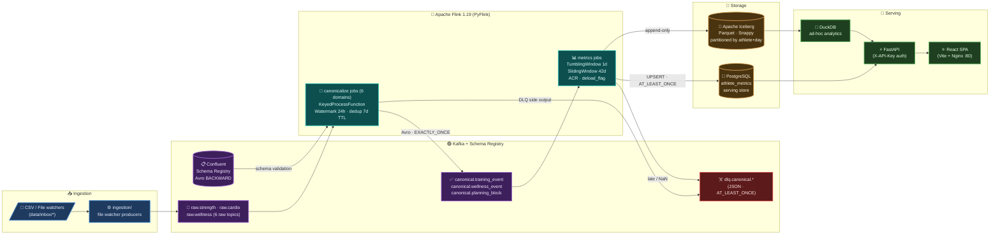

# AthleteOS

Real-time athlete data platform built on an event-staged architecture
(`raw -> canonical -> stream processing -> serving -> analytical -> API/UI`).

Stack: Python 3.11, Apache Kafka, Confluent Schema Registry, Apache Flink
(PyFlink), Apache Iceberg (Parquet), PostgreSQL, DuckDB, FastAPI, React (Vite +
Nginx), Docker Compose.

## Architecture



> Full architecture with ADRs, data flow walkthrough, and design decisions: [`docs/ARCHITECTURE.md`](docs/ARCHITECTURE.md)

## Repository layout

```
jobs/          PyFlink stream processing jobs (canonicalize, metrics) - PR3/PR4
ingestion/     Source connectors -> raw.* topics - PR2+
schemas/       Canonical Avro schemas (.avsc) governed by Schema Registry
bootstrap/     One-shot schema registration + topic creation
storage/       PostgreSQL DDL + Iceberg table definitions - PR5
api/          FastAPI serving - PR6
web/          React SPA (Vite build, served via Nginx on port 80) - PR6
tests/unit/        pytest unit tests (no Docker needed)
tests/integration/ pytest integration tests (require a running Docker daemon)
```

## Local runtime (Docker Compose profiles)

Profiles mitigate service-count friction:

- `core` - kafka, schema-registry, flink-jobmanager, flink-taskmanager, postgres
- `bootstrap` - one-shot schema registration + topic creation
- `ingest` - ingestion file watchers (PR2)
- `jobs` - one-shot Flink job submission (strength canonicalize + metrics)
- `serve` - FastAPI + React SPA via Nginx (PR6)

```bash
# Start the processing core + bootstrap the topics/schemas once.
docker compose --profile core --profile bootstrap up -d

# Just (re)run the one-shot bootstrap against an already-running core.
docker compose --profile bootstrap run --rm schema-bootstrap
```

Bootstrap registers the three canonical Avro schemas with `BACKWARD`
compatibility (TopicNameStrategy subjects, `canonical.<event>-value`) and
creates the 12-topic Kafka topology (6 raw + 3 canonical + 3 DLQ), each with
exactly 8 partitions and the retention/compaction configs from the
event-contracts spec.

## Zero-to-data: automated strength pipeline (G4)

The full strength pipeline (raw CSV → canonical Avro → athlete_metrics → API/SPA)
is now automated end-to-end with a single command sequence:

```bash
# 1. Start core services + bootstrap topics/schemas + submit Flink jobs + serve API/SPA.
docker compose --profile core --profile bootstrap --profile jobs --profile serve up -d --build

# The flink-job-submit service (profile: jobs) waits for the Flink cluster,
# Kafka, Postgres, and schema-bootstrap to be ready, then runs:
#   flink run -pym jobs.canonicalize.main -pyfs /opt/flink/usrlib
#   flink run -pym jobs.metrics.main     -pyfs /opt/flink/usrlib
# Both jobs stream in the cluster; the submit container exits 0.

# 2. Drop sample strength data (ingestion connector picks it up automatically).
docker compose --profile ingest up -d
# Sample CSVs are already in data/inbox/*/sample.csv — the watchers pick them up.

# 3. Check Flink jobs are running (both should show RUNNING).
curl http://localhost:8082/jobs

# 4. Verify athlete_metrics is populated.
#    Connect to postgres and run:
#    SELECT COUNT(*) FROM athlete_metrics WHERE athlete_id = '<seed_athlete_id>';
#
#    NOTE — event-time windows, not wall-clock: the metrics job aggregates on a
#    daily TumblingEventTimeWindow with 24h allowed lateness. A window for day D
#    only closes (and writes rows) once the watermark passes D + 48h, and the
#    watermark is (max event timestamp − 24h out-of-orderness). This is why the
#    shipped data/inbox/strength/sample.csv spans MULTIPLE consecutive days
#    (2026-06-20 .. 2026-06-30): a single-day CSV never advances the watermark
#    far enough to fire any window, so athlete_metrics would stay empty. If you
#    supply your own data, make sure it spans at least ~3 event-time days.

# 5. Access the API and SPA.
# FastAPI: http://localhost:8000/docs
# React SPA: http://localhost:80
```

**Notes on the custom Flink image** (`docker/flink/Dockerfile`):
- Built FROM `flink:1.19` (Ubuntu Jammy 22.04, Python 3.10 via apt).
- Installs `apache-flink==1.19.3` PyPI wheel on Python 3.10.
- Bundles 3 connector JARs committed to `docker/flink/lib/` for offline reproducibility:
  `flink-connector-kafka-3.3.0-1.19.jar`, `kafka-clients-3.6.0.jar`,
  `flink-sql-avro-confluent-registry-1.19.1.jar`.
- Shared by flink-jobmanager, flink-taskmanager, and flink-job-submit
  (TaskManager must carry Python runtime for PyFlink UDFs).
- A build-time `RUN ls` assertion verifies the schemas/ COPY layout at build time
  so a wrong directory layout fails the image build, not silently at job submission.

## Test harness

```bash
pip install -e ".[dev]"          # pytest, testcontainers[kafka], requests
pytest                           # unit tests run; integration tests need Docker
pytest --collect-only            # verify the harness is wired
pytest -m "not integration"     # skip Docker-gated integration tests
```

Integration tests use [testcontainers](https://testcontainers-python.readthedocs.io/)
and a Redpanda container that serves both Kafka and a Schema Registry. They are
**skipped automatically when the Docker daemon is unreachable**. To run them:

```bash
# Ensure Docker Desktop / the docker daemon is running, then:
pytest -m integration
```

## Launch with data (zero to populated UI)

End-to-end sequence after a clean clone. Requires Docker Compose and Python 3.11.

### 1. Configure environment

```bash
cp .env.example .env
# Edit .env — set POSTGRES_PASSWORD, API_KEY, JWT_SECRET, GF_SECURITY_ADMIN_PASSWORD

cp web/.env.example web/.env
# Edit web/.env — set VITE_API_KEY to the SAME value as API_KEY in root .env
# (Vite bakes this into the bundle; rebuild the web image after any change)
```

### 2. Start core infrastructure

```bash
docker compose --profile core up -d
# Postgres DDL is applied automatically on first start (docker-entrypoint-initdb.d).
# Wait for all services to be healthy before proceeding.
```

### 3. Register schemas and create Kafka topics (one-shot)

```bash
docker compose --profile bootstrap run --rm schema-bootstrap
```

### 4. Seed a login user

```bash
# Requires psycopg2-binary: pip install psycopg2-binary  (or pip install -e ".[dev]")
DATABASE_URL=postgresql://athleteos:<POSTGRES_PASSWORD>@localhost:5432/athleteos \
    python -m tools.seed_user --username admin --password <your-password>
```

### 5. Start ingestion and drop sample data

```bash
docker compose --profile ingest up -d
# Sample CSVs are already in data/inbox/*/sample.csv — the watchers will pick them up.
# Add more files to data/inbox/<connector>/ at any time.
```

### 6. Submit the strength Flink jobs (automated via the `jobs` profile)

The raw-to-canonical and canonical-to-metrics jobs are submitted automatically by
the one-shot `flink-job-submit` service. It waits for the Flink cluster, Kafka,
Postgres, and schema-bootstrap to be ready, then runs both jobs detached:

```bash
docker compose --profile core --profile jobs up -d
# The flink-job-submit container runs:
#   flink run -d -pym jobs.canonicalize.main -pyfs /opt/flink/usrlib
#   flink run -d -pym jobs.metrics.main     -pyfs /opt/flink/usrlib
# then exits 0. Confirm both jobs are RUNNING:
curl http://localhost:8082/jobs
```

Until these jobs run, the `athlete_metrics` table stays empty. Note that metrics
use daily event-time windows: see the "Zero-to-data" section above for why the
sample data must span multiple event-time days for windows to fire.

### 7. Start the API and React SPA

```bash
docker compose --profile serve up -d
# React SPA: http://localhost:80
# FastAPI:   http://localhost:8000/docs
```

### What works after these steps

| Layer | Status |
|-------|--------|
| Kafka topics + Avro schemas | ✅ registered by bootstrap |
| Postgres tables | ✅ created automatically on first postgres start |
| Login user | ✅ seeded via tools/seed_user.py |
| CSV ingestion → raw Kafka topics | ✅ sample.csv files trigger the watchers |
| Flink canonicalize + metrics jobs | ✅ automated via the `jobs` profile (G4) |
| athlete_metrics populated | ✅ after jobs run + multi-day event-time data |
| React SPA + FastAPI | ✅ serve profile |

## SDD context

This repository is being built under the SDD workflow. Change artifacts for the
foundation slice live under `openspec/changes/athleteos-foundation/`. The
event-contracts, architecture, serving-store, and analytical-store specs are
the source of truth; nothing in code may contradict them without an explicit
ADR.