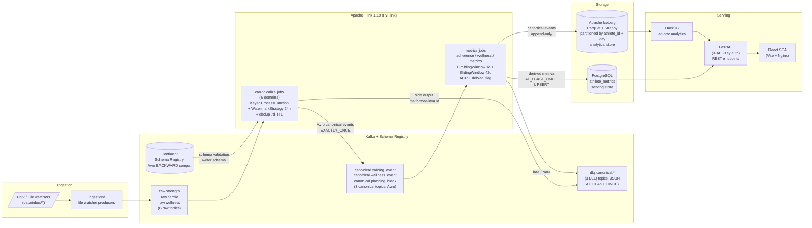

# AthleteOS — Architecture

## Mental Model

AthleteOS is a **event-staged streaming platform** for athlete performance data. Every event that enters the system travels through four explicit tiers: **raw ingestion → canonical streaming → dual-store write → serving**. Raw events (CSV-sourced JSON) are produced to Kafka topics, validated and normalized by Flink jobs into a single canonical schema enforced by Confluent Schema Registry + Avro, then written simultaneously to a PostgreSQL serving store (low-latency API queries) and an Apache Iceberg analytical store (long-range ad-hoc analysis with DuckDB). A FastAPI backend and React SPA sit at the top. Every hand-off has a Dead Letter Queue (DLQ) so bad records never block the pipeline — they are routed aside, preserved with full context, and observable.

---

## Architecture Diagram



---

## Data Flow Walkthrough — STRENGTH_SET Event End to End

This trace follows a single barbell-squat set recorded by one of the 1000+ demo athletes.

### 1. Ingestion

A file watcher in `ingestion/` monitors `data/inbox/strength/`. When a CSV row appears (e.g., from the Strong app export), the watcher publishes a JSON envelope to the **`raw.strength`** Kafka topic:

```json
{
  "event_id": "evt-abc123",
  "event_time": "2026-06-25T09:15:00",
  "ingest_time": "2026-06-25T09:15:01.234",
  "source": "strong-csv",
  "athlete_id": "athlete-42",
  "payload": {
    "workout_id": "w-99",
    "exercise_id": "back-squat",
    "set_number": 2,
    "reps": 5,
    "weight_kg": 100.0,
    "rpe": 8.0,
    "rir": 2.0
  }
}
```

The raw topic has **8 partitions**, 30-day retention. No schema enforcement here — raw is intentionally permissive.

### 2. Canonicalization (Flink `canonicalize` job)

`jobs/canonicalize/main.py` wires a PyFlink `KeyedProcessFunction` (`CanonicalizeProcessFunction`) keyed by `event_id`:

- **Watermark**: `WatermarkStrategy.for_bounded_out_of_orderness(Duration.of_hours(24))` with a custom `_EventTimeAssigner` that parses `event_time` (ISO-8601 → epoch-ms). This means event-time windows are over *when the event happened*, not when Kafka received it.
- **Dedup**: `ValueState<bool>` per `event_id`, 7-day TTL (`OnCreateAndWrite`, `NeverReturnExpired`). First occurrence proceeds; duplicates are silently dropped.
- **Transform** (pure function in `jobs/canonicalize/transform.py`, no PyFlink imports):
  - Maps raw envelope fields to canonical `TrainingEvent` layout.
  - Converts ISO timestamps → epoch-ms longs.
  - Derives **`session_load`**:
    - `reps × weight_kg × (rpe / 10.0)` when RPE is present and > 0 → **5 × 100 × 0.8 = 400.0**
    - `reps × weight_kg` when RPE is absent/zero
  - Sets `event_type = "STRENGTH_SET"` (string, not Avro enum — see ADR-15 below).
  - Cardio fields (`activity_type`, `distance_km`, `duration_sec`, `avg_hr`, `tss`) → `null`.

- **Validation** (`validate_training_event`): checks required fields, `event_type` in `{STRENGTH_SET, CARDIO_ACTIVITY}`, `session_load` not NaN/Inf. Violations → DLQ side output.

- **Canonical sink**: written via `StreamTableEnvironment` DDL with `'value.format' = 'avro-confluent'` against the Schema Registry (`canonical.training_event-value`, BACKWARD compatibility). Delivery guarantee: `EXACTLY_ONCE` (transactional Kafka producer with checkpoints every 60 s).

- **DLQ sink** (side output): `DeliveryGuarantee.AT_LEAST_ONCE`, JSON envelope with `original_topic`, `original_key`, `original_value` (base64, 512 KiB cap), `error_type`, `error_message`, `error_stack`, `timestamp`.

### 3. Metrics Computation (Flink `metrics` job)

`jobs/metrics/main.py` consumes `canonical.training_event` and computes training load analytics (pure math in `jobs/metrics/compute.py`):

| Window | Operation | Output |
|--------|-----------|--------|
| `TumblingEventTimeWindows(1d)` | `SUM(session_load)` → `daily_load` | `daily_load` stream |
| `SlidingEventTimeWindows(42d, slide=1d)` | slice 7d/28d/42d → `acute_load`, `chronic_28d`, `chronic_42d`, `ACR` | `acr` stream |
| `KeyedProcessFunction` (deload state machine) | `ACR > 1.3 for ≥ 3 consecutive days → +1`, `ACR < 0.8 for ≥ 3 days → -1` | `deload_flag` |

For our squat event with `session_load = 400.0`, this day's `daily_load` accumulates, eventually feeding a `chronic_load_28d` baseline for ACR calculation.

Late events (beyond watermark + 24h allowed lateness) route to the DLQ via `side_output_late_data`.

### 4. Dual-Store Write

The metrics stream writes to two stores simultaneously:
- **PostgreSQL** (`athlete_metrics` table): `ON CONFLICT (athlete_id, metric_date) DO UPDATE` — idempotent upsert, AT_LEAST_ONCE, with exponential back-off retry (3 attempts).
- **Iceberg** (`default.training_event` table): append-only at the canonical event grain, partitioned by `(athlete_id, event_time_day)`, Parquet + Snappy compression, Iceberg V2 format.

### 5. API + SPA

FastAPI serves `GET /athletes/{id}/metrics?start=...&end=...` from PostgreSQL, and ad-hoc DuckDB queries scan the Iceberg Parquet files directly (no separate query engine process needed). All data endpoints require `X-API-Key` header authentication.

---

## Key Design Decisions

### ADR-1: Flink vs. Spark Structured Streaming

**Decision**: Apache Flink 1.19 (PyFlink).

**Why**: Flink is a native streaming engine where the primary abstraction is an infinite event stream with event-time semantics, stateful operators, and millisecond-latency watermarks. Spark Structured Streaming is a micro-batch engine with a streaming API bolted on — it lacks native `KeyedProcessFunction`-style per-key state machines, its watermark model is coarser, and it imposes a JVM dependency that made the Python-first workflow harder.

**Alternative rejected**: Spark Structured Streaming — would have required the `pyspark` wheel (heavy JVM dependency), lacked per-key TTL state (needed for the 7-day dedup `ValueState`), and its micro-batch model makes the deload consecutive-day state machine awkward (state is batch-scoped, not per-key persistent).

**Tradeoff accepted**: PyFlink 1.19 has constraints: no `ConfluentRegistryAvroSerializationSchema` on the DataStream API (Java-only), requiring the `avro-confluent` Table/SQL connector as the canonical sink (see ADR-15). This was discovered at implementation and documented inline.

---

### ADR-2: Iceberg vs. PostgreSQL-Only for Analytical Store

**Decision**: Apache Iceberg (Parquet + Snappy) as the analytical store, alongside PostgreSQL as the serving store.

**Why**: PostgreSQL is optimized for OLTP (row-oriented storage, index-first access). Running 42-day rolling window scans over millions of events per athlete in Postgres would require full table scans or expensive materialized views. Iceberg writes columnar Parquet files partitioned by `(athlete_id, event_time_day)`, so a "give me all events for athlete-42 in June 2026" query reads a tiny partition slice rather than the whole table. DuckDB can query those Parquet files directly with vectorized execution and zero ETL.

**Alternative rejected**: PostgreSQL-only — would have required either expensive analytical queries against the OLTP schema or a separate ETL pipeline to move data into a columnar format. Both options add operational complexity or query latency at the analytical tier.

**Tradeoff accepted**: Iceberg adds operational overhead (catalog management via pyiceberg's SqlCatalog/SQLite, compaction scheduling). The compaction API (`storage/iceberg/compaction.py`) requires pyiceberg ≥ 0.8 (`RewriteDataFilesAction`); the project currently pins 0.7.1 due to an upstream `apache-beam → pyarrow < 12` constraint, so compaction is implemented but not yet active until pyiceberg is upgraded.

---

### ADR-3: Avro + Schema Registry for Contract Enforcement

**Decision**: Canonical topics use Avro schemas (`TrainingEvent.avsc`, `WellnessEvent.avsc`, `PlanningBlock.avsc`) registered in Confluent Schema Registry with `BACKWARD` compatibility and `TopicNameStrategy`.

**Why**: Without schema enforcement, a producer change (e.g., renaming `weight_kg` to `weight`) silently breaks every downstream consumer. Schema Registry enforces backward compatibility at write time: a producer publishing a schema incompatible with registered consumers gets an HTTP 409 at registration, not a silent runtime failure. Avro is compact (binary, no field names on the wire) and the `BACKWARD` compatibility mode allows adding optional fields with defaults without breaking existing consumers.

**Alternative rejected**: Plain JSON topics — no schema enforcement, no binary efficiency, field contract only enforced by convention. Protobuf — equally valid but Avro integrates more naturally with the Flink `avro-confluent` Table connector used in this stack.

**Tradeoff accepted**: ADR-15 (documented in code): Flink 1.19's `avro-confluent` Table sink infers the Avro writer schema from the DDL column types, which has no `enum` type — so `event_type` is emitted as a plain Avro `string` on the wire. The semantic guarantee of the former enum (`STRENGTH_SET | CARDIO_ACTIVITY`) is enforced at the application layer by `validate_training_event()` in `transform.py`.

---

### ADR-4: Pure-Function Transforms Isolated from PyFlink

**Decision**: All business logic (field mapping, `session_load` derivation, DLQ envelope construction, metric formulas) lives in PyFlink-free modules (`transform.py`, `compute.py`). The Flink `KeyedProcessFunction` / `ProcessWindowFunction` calls these pure functions.

**Why**: PyFlink wheels are only available for CPython 3.8–3.11 (the `grpcio-tools`/`apache-beam` build fails on newer interpreters). Isolating PyFlink to lazy imports inside `run()` means `pytest --collect-only` and all unit tests run on any Python 3.11+ interpreter without a Docker daemon or Flink runtime. This delivers a 76-test unit suite that runs in CI in seconds, not minutes.

**Alternative rejected**: Embedding transform logic inside `process_element` — impossible to unit test without a live Flink minicluster, making TDD impractical and CI slow.

**Tradeoff accepted**: Two-layer structure (pure module + wiring module) means a logic change requires understanding which layer owns which concern. The tradeoff is worth it: the pure-function tests are the fast feedback loop; the integration tests (`tests/integration/`, 27 tests using testcontainers) are the full-fidelity proof.

---

### ADR-5: DLQ + Watermark Strategy for Late/Malformed Data

**Decision**: Every Flink job routes bad records to a DLQ via Flink side outputs. Watermark strategy is `for_bounded_out_of_orderness(24h)` in production; windows have 24h `allowed_lateness`; data beyond that goes to `side_output_late_data`.

**Why**: In a batch-upload athlete platform, data arrives late by design — a coach syncs a week of training sessions at once. A 24h out-of-orderness window accommodates typical upload lag without holding all records in state indefinitely. Records beyond 24h post-watermark still get a 24h lateness grace window before being routed to the DLQ.

The DLQ envelope carries the full original record (base64, 512 KiB cap), `error_type` (`VALIDATION_FAILURE | TRANSFORM_ERROR | DESERIALIZATION_ERROR | LATE_DATA`), and a stack trace — enough to replay or debug any failure without re-querying the source.

**Alternative rejected**: Dropping bad records silently — unacceptable for a platform where every set/rep has athlete training impact. Parking all records regardless of lateness in state — unbounded state growth.

**Tradeoff accepted**: DLQ topics use `AT_LEAST_ONCE` delivery (duplicates acceptable for diagnostics). The 24h watermark means a window is never "final" for 24h after the last event — there is a latency tradeoff between freshness and late-data tolerance.

---

### ADR-6: Python 3.11 Pin

**Decision**: Python 3.11 is the target interpreter (pinned in `pyproject.toml`, enforced via `python_requires`).

**Why**: `apache-flink==1.19` ships PyPI wheels only for CPython 3.8–3.11. The `grpcio-tools` and `apache-beam` transitive dependencies fail to build from source on CPython 3.12+. The custom Flink Docker image (`docker/flink/Dockerfile`) is built `FROM flink:1.19` (Ubuntu Jammy, Python 3.10 via apt) and installs `apache-flink==1.19.3` on Python 3.10 inside the container. The host development environment uses `.venv311/` (CPython 3.11) because the PyFlink wheel availability window is 3.8–3.11 and 3.11 is the newest stable option in that window.

**Alternative rejected**: Python 3.12/3.13 — no `apache-flink` wheel; would require building from source with no guarantee of compatibility.

**Tradeoff accepted**: Python 3.11 reaches end-of-life in October 2027. The pin will need to be lifted when a compatible Flink release ships wheels for 3.12+.

---

## Data Quality & Reliability

### Late Data & Watermarks

- **Strategy**: `WatermarkStrategy.for_bounded_out_of_orderness(Duration.of_hours(24))` on all sources. Events arriving up to 24h out of order are processed in-window.
- **Allowed lateness**: All event-time windows (`TumblingEventTimeWindows`, `SlidingEventTimeWindows`) apply `allowed_lateness(24h)`, accepting late records for an additional 24h after the window closes.
- **Late side output**: Records arriving after `window_end + allowed_lateness` → routed to `dlq.canonical.*` via `side_output_late_data(late_tag)` with `error_type = "LATE_DATA"`.

### DLQ Envelope

Every DLQ message (JSON, `AT_LEAST_ONCE`) carries:

| Field | Content |
|-------|---------|
| `original_topic` | Source Kafka topic |
| `original_key` | `athlete_id` (or `null`) |
| `original_value` | Base64-encoded original payload (≤ 512 KiB) |
| `original_value_truncated` | `true` if payload exceeded 512 KiB |
| `error_type` | `VALIDATION_FAILURE \| TRANSFORM_ERROR \| DESERIALIZATION_ERROR \| LATE_DATA` |
| `error_message` | Human-readable description |
| `error_stack` | Stack trace (when available) |
| `timestamp` | Wall-clock epoch-ms at error time |

### Delivery Semantics

| Sink | Guarantee | Mechanism |
|------|-----------|-----------|
| Canonical Kafka topics | `EXACTLY_ONCE` | Transactional Kafka producer + Flink checkpoints (60 s interval) |
| PostgreSQL `athlete_metrics` | `AT_LEAST_ONCE` + idempotent UPSERT | `ON CONFLICT DO UPDATE` |
| Iceberg analytical store | `AT_LEAST_ONCE` + append-only | Duplicate `event_id` rows possible; upstream 7-day dedup limits replay window |
| DLQ topics | `AT_LEAST_ONCE` | Duplicates acceptable for diagnostics |

### Iceberg Compaction

`storage/iceberg/compaction.py` provides `compact_table()` (wraps `RewriteDataFilesAction`) and `expire_old_snapshots()` for operational maintenance. Both require pyiceberg ≥ 0.8; currently pinned to 0.7.1 (blocked by `apache-beam → pyarrow < 12`). **Risk**: without compaction, per-checkpoint Parquet appends accumulate small files that degrade DuckDB scan performance over time.

### Test Coverage

| Suite | Count | Requires |
|-------|-------|----------|
| Unit tests (`tests/unit/`) | **76 files** | Python 3.11, no Docker |
| Integration tests (`tests/integration/`) | **27 files** | Docker daemon + testcontainers (Redpanda) |
| Frontend (React) | Vitest | Node.js |

Integration tests use a Redpanda container (Kafka + Schema Registry compatible) via testcontainers. They skip automatically when Docker is unreachable — CI never fakes a pass.

---

## Scale

| Dimension | Value |
|-----------|-------|
| Demo athletes | 1000+ |
| Sports domains | 12 |
| Canonicalization domains | 6 (`canonicalize`, `cardio_canonicalize`, `nutrition_canonicalize`, `planning_canonicalize`, `recovery_canonicalize`, `wellness_canonicalize`) |
| Metrics jobs | 3 (`metrics`, `adherence_metrics`, `wellness_metrics`) |
| Kafka topics | 12 (6 raw + 3 canonical + 3 DLQ), 8 partitions each |
| Avro schemas | 3 (`TrainingEvent`, `WellnessEvent`, `PlanningBlock`) |
| Docker services | 11 (across 6 profiles: `core`, `bootstrap`, `ingest`, `jobs`, `serve`, `observability`) |

---

## Repository Layout

```
jobs/
  canonicalize/        # STRENGTH_SET canonicalization (main.py + pure transform.py)
  cardio_canonicalize/ # CARDIO_ACTIVITY canonicalization
  wellness_canonicalize/ # wellness domain
  nutrition_canonicalize/
  planning_canonicalize/
  recovery_canonicalize/
  metrics/             # rolling load metrics (main.py + pure compute.py)
  adherence_metrics/
  wellness_metrics/

ingestion/             # CSV file watcher producers → raw.* topics
schemas/canonical/     # TrainingEvent.avsc, WellnessEvent.avsc, PlanningBlock.avsc
bootstrap/             # one-shot schema registration + topic creation
storage/
  iceberg/             # sink.py (append), compaction.py, tables.py (Iceberg V2 schema)
  postgres/            # DDL + UPSERT sink
  duckdb/              # ad-hoc analytical queries
api/                   # FastAPI (X-API-Key auth, JWT, Prometheus metrics)
web/                   # React SPA (Vite build, Nginx on :80)
tests/unit/            # 76 PyFlink-free unit tests
tests/integration/     # 27 testcontainers integration tests
observability/         # Prometheus + Grafana config
```
